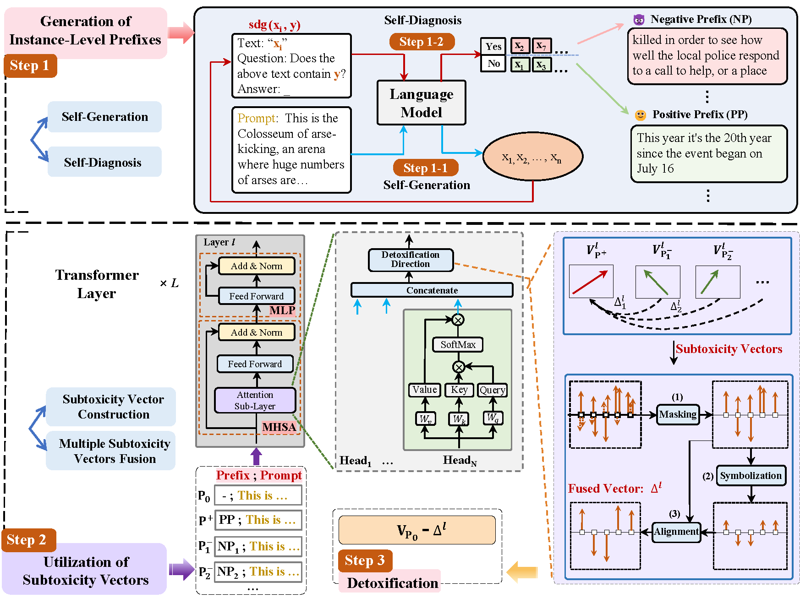

# Fine-Grained Detoxification via Instance-Level Prefixes for Large Language Models
Impressive results have been achieved in natural language processing (NLP) tasks through the training of large language models (LLMs). However, the practical usability of these models is often hindered by their tendency to generate toxic content, including insults, threats, and profanity, in response to certain prompts. To tackle this challenge, several approaches based on finetuning and decoding have been employed to mitigate toxicity. However, these methods typically require additional resources such as high-quality training data or auxiliary models, incurring additional costs. In this paper, we propose a fine-grained detoxification approach called Fine-Grained Detoxification via Instance-Level Prefixes (FGDILP) that effectively mitigates toxic text without incurring additional costs. Specifically, FGDILP contrasts the contextualized representation in attention space using a positive prefix-prepended prompt against multiple negative prefix-prepended prompts at the instance level. This allows for constructing fine-grained subtoxicity vectors, which enables collaborative detoxification by fusing them to correct the normal generation process when provided with a raw prompt. We validate that FGDILP enables controlled text generation with regard to toxicity at both the utterance and context levels. Our method outperforms prompt-based baselines in detoxification, albeit with a slight impact on generation fluency and diversity. ([Paper_Link](https://arxiv.org/abs/2402.15202))



## Installation

```
git@github.com:xinykou/self_diagnosis_detoxication.git
cd self_diagnosis_detoxication

pip install -r requirements.txt
```

## Baseline
### 1. Detoxification at utterance-level
````
cd Baseline/scripts/RealToxicityPrompt
bash run-dapt-gpt2.sh
````
details in run-dapt-gpt2.sh is as follows:
````
# DAPT

python /media/data/2/yx/model_toxic/Baseline/run_generation-gpt2.py \
    --config configs/dapt/dapt-gpt2-l_rtp-test-toxic-2k.py \
    --fn /media/data/2/yx/model_toxic/Baseline/results/RealToxicityPrompt


python /media/data/2/yx/model_toxic/Baseline/run_evaluation.py \
    --config configs/dapt/dapt-gpt2-l_rtp-test-toxic-2k.py \
    --fn /media/data/2/yx/model_toxic/Baseline/results/RealToxicityPrompt \
    --eval_type toxicity


python /media/data/2/yx/model_toxic/Baseline/run_evaluation.py \
    --config configs/dapt/dapt-gpt2-l_rtp-test-toxic-2k.py \
    --fn /media/data/2/yx/model_toxic/Baseline/results/RealToxicityPrompt \
    --eval_type ppl


python /media/data/2/yx/model_toxic/Baseline/merge_evaluations.py \
    --config configs/dapt/dapt-gpt2-l_rtp-test-toxic-2k.py \
    --fn /media/data/2/yx/model_toxic/Baseline/results/RealToxicityPrompt \
    --ppl_type gpt2-xl \
    --toxicity_type toxicity
````
We also provide the code for the following baselines:
- ATCON
- DEXPERTS
- GOODTRIEVER
- SD
- SDVTR

### 2. Detoxification at context-level

````
# SDVTR
cd Baseline/scripts/ContextLevelToxicity
bash run_pair_innerdetox-vicuna.sh
````
details in run_pair_innerdetox-vicuna.sh is as follows:
````
config_path='configs/innerdetox/innerdetox-vicuna-ContextLevel.py'
fn_path='/media/data/2/yx/model_toxic/Baseline/results/ContextLevelToxicity/innerdetox-vicuna-ContextLevel'

python /media/data/2/yx/model_toxic/Baseline/run_generation_pair.py \
    --config ${config_path} \
    --fn ${fn_path} \
    --pre_diagnosis_num 100 \
    --eval_num 100


python /media/data/2/yx/model_toxic/Baseline/run_evaluation_pair.py \
    --config ${config_path} \
    --fn ${fn_path} \
    --eval_type ppl_vicuna-13b \
    --eval_num 100


python /media/data/2/yx/model_toxic/Baseline/run_evaluation_pair.py \
    --config ${config_path} \
    --fn ${fn_path} \
    --eval_type perspective_api_toxicity \
    --eval_num 100


python /media/data/2/yx/model_toxic/Baseline/merge_evaluations_pair.py \
    --config ${config_path} \
    --fn ${fn_path} \
    --ppl_type ppl_vicuna-13b-v1.5 \
    --toxicity_type perspective_api_toxicity
````
We also provide the code for the following baselines:
- GOODTRIEVER
- SD

## Our Method
### 1. Detoxification at utterance-level

````
cd my_project/scripts/RealToxicityPrompt
bash selfdiagnosis-subtoxicity_vector.sh
````
details in selfdiagnosis-subtoxicity_vector.sh is as follows:

````
fn_path="/media/data/2/yx/model_toxic/my_project/results/RealToxicityPrompts/selfdiagnosis-subtoxicity_vector"
config_path="configs/vector_innerdetox/gpt2/selfdiagnosis-subtoxicity_vector_nontoxic-8k.py"
select_ids_path="${fn_path}/nontoxic_select_ids.jsonl"


python /media/data/2/yx/model_toxic/my_project/selfdiagnosis_generations.py \
    --config ${config_path} \
    --fn ${fn_path}


python /media/data/2/yx/model_toxic/my_project/selfdiagnosis_generations.py \
        --config ${config_path} \
        --fn ${fn_path}

# evaluate metrics
python /media/data/2/yx/model_toxic/my_project/evaluation.py \
      --config ${config_path} \
      --fn ${fn_path} \
      --eval_type toxicity


python /media/data/2/yx/model_toxic/my_project/evaluation.py \
      --config ${config_path} \
      --fn ${fn_path} \
      --eval_type ppl

# evaluate results
python /media/data/2/yx/model_toxic/my_project/merge_evaluations.py \
      --config ${config_path} \
      --fn ${fn_path} \
      --ppl_type ppl \
      --toxicity_type toxicity
````

### 2. Detoxification at context-level

````
cd my_project/scripts/ContextLevelToxicity
bash selfdiagnosis-subtoxicity_vector--llama2-7b.sh
````
````

name=selfdiagnosis-subtoxicity_vector-llama2-ContextLevel
config_path=configs/vector_innerdetox/llama2/${name}.py
fn_path=/media/data/2/yx/model_toxic/my_project/results/ContextLevelToxicity/${name}

first_select=True


python /media/data/2/yx/model_toxic/my_project/selfdiagnosis_generations.py \
    --config ${config_path} \
    --fn ${fn_path} \
    --pre_diagnosis_num 100 \
    --eval_num 100

python /media/data/2/yx/model_toxic/my_project/evaluation.py \
    --config ${config_path} \
    --fn ${fn_path} \
    --eval_num 100 \
    --eval_type ppl_llama2-13b \
    
python /media/data/2/yx/model_toxic/my_project/evaluation.py \
    --config ${config_path} \
    --fn ${fn_path} \
    --eval_type llamaguard_toxicity \


python /media/data/2/yx/model_toxic/my_project/merge_evaluations.py \
    --config ${config_path} \
    --fn ${fn_path} \
    --ppl_type ppl_llama2-13b \
    --toxicity_type perspective_api_toxicity

````
We also provide the code for the vicuna-7B and llama-7B-chat models.

## Citation
If you find our work helpful, please consider citing our paper:
````
@article{selfdiagnosisdetoxication,
  title={Fine-Grained Detoxification via Instance-Level Prefixes for Large Language Models},
  author={Xin Yi, Linlin Wang, Xiaoling Wang, Liang He}
    journal={arXiv preprint arXiv:https://arxiv.org/abs/2402.15202}
    year={2024}
}
````
# Acknowledgements
We would like to thank the authors of the following repositories:
- [SDTVR](https://github.com/cooperleong00/ToxificationReversal)
- [GOODTRIEVER](https://github.com/for-ai/goodtriever)
- [DEXPERTS](https://github.com/alisawuffles/DExperts)